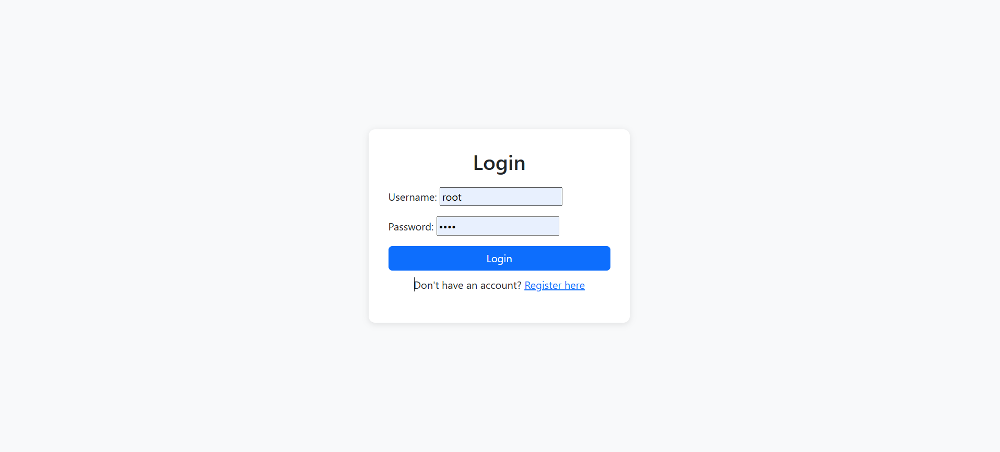
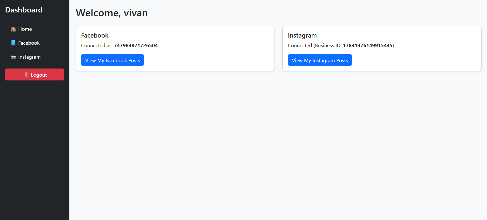
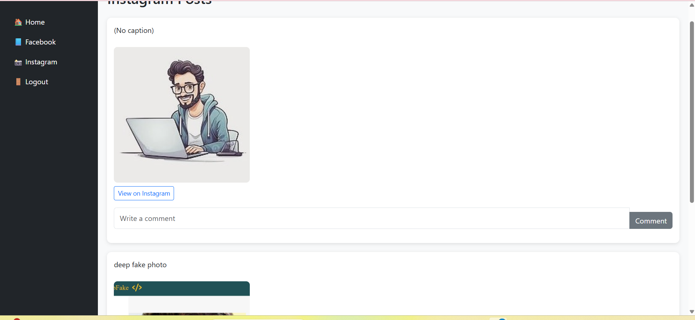
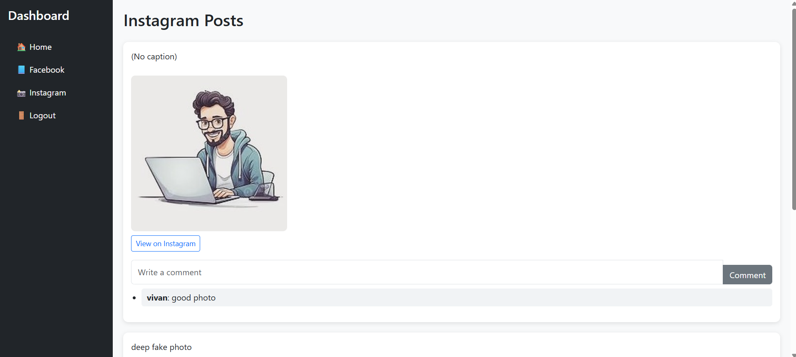
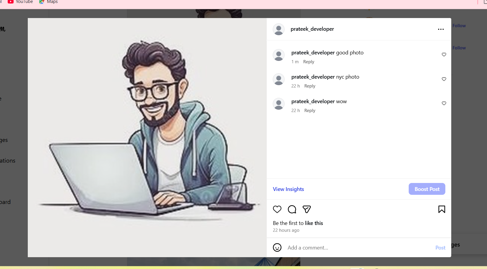

# Social Media Dashboard

## Overview
A Django-based dashboard that integrates Facebook and Instagram, allowing users to:
- Register and log in.
- Connect their Facebook account.
- View Facebook and Instagram posts.
- Like and comment on posts from the dashboard.

## Features
- User Authentication (Login, Register, Logout)
- Facebook API integration
- Instagram API integration
- AJAX-based like & comment functionality
- Responsive dashboard UI

## Installation & Setup
1. Clone the repo:
   git clone [https://github.com/PrateekBhardwajj/django-social-connect.git]
   cd social-media-dashboard
2. Create Virtual Environment:
3. python -m venv venv
   venv\Scripts\activate
4. Install dependencies:
   pip install -r requirements.txt
5. Run migrations:
   python manage.py migrate
6. Create Superuser:
   python manage.py createsuperuser
7. Start the server:
   python manage.py runserver

## Facebook/Instagram Setup
1. Go to Meta for Developers.
2. Create an app and configure:
   Facebook Login 
   Permissions: pages_manage_posts, pages_read_engagement, instagram_basic.
3. Add OAuth redirect URI:
   http://localhost:8000/facebook/callback/.
4. Connect account from dashboard.

## Screenshots

### 1. Login Page

### 2. Dashboard

### 3. Instagram Post

### 4. Comment Before Posting

### 5. Comment After Posting

